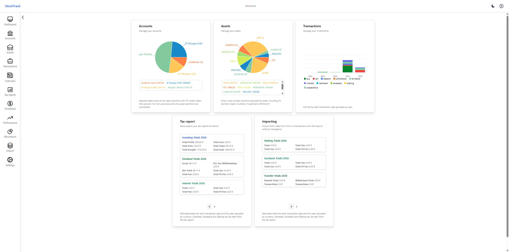
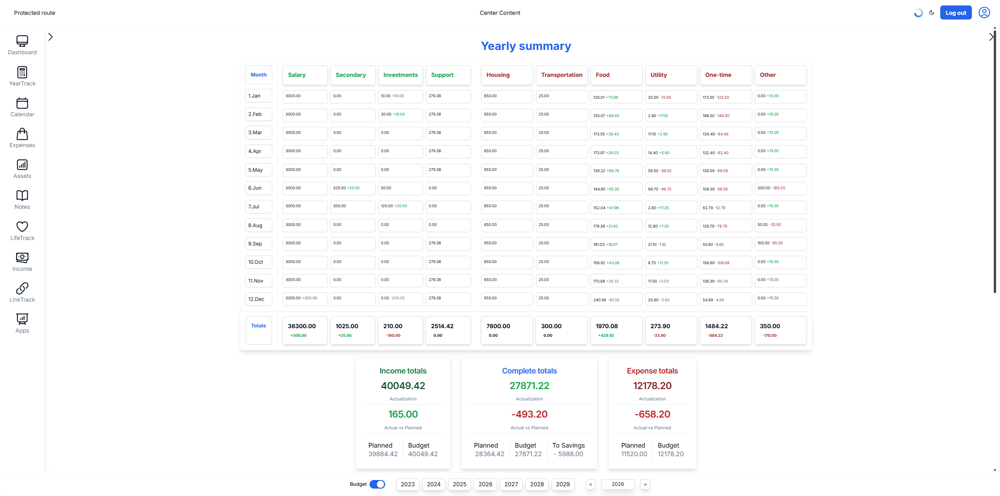
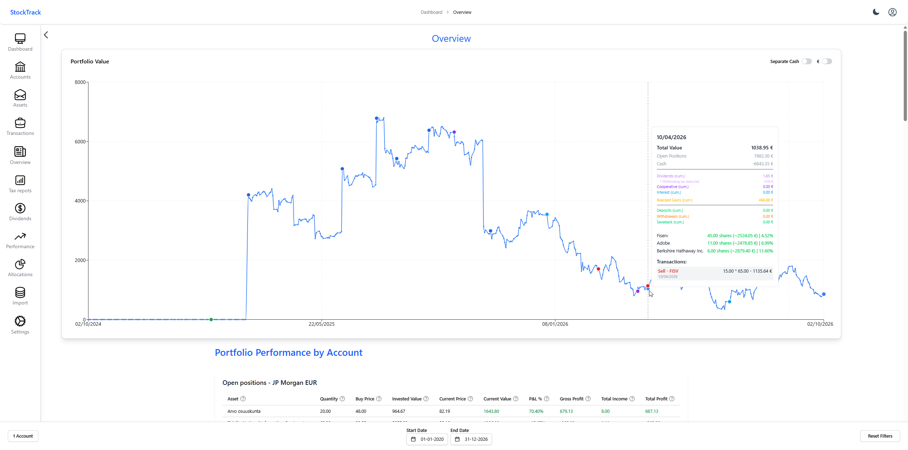
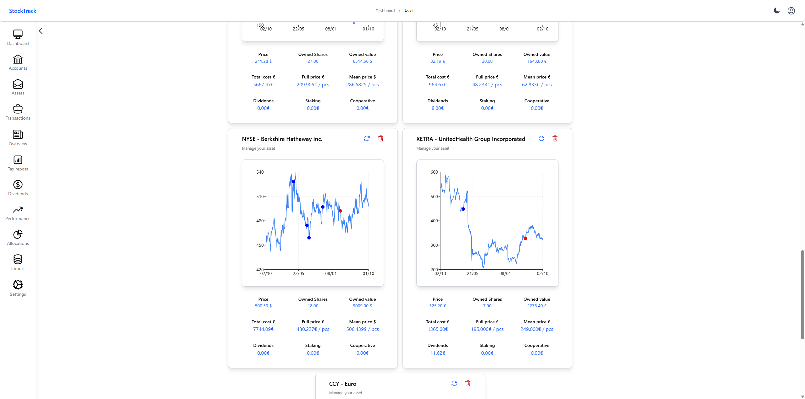
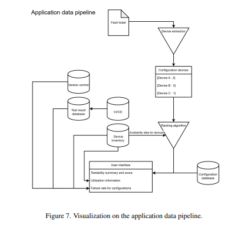
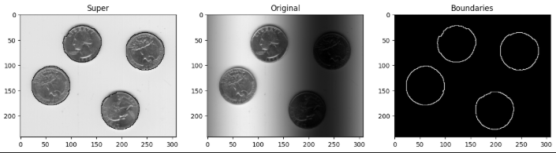
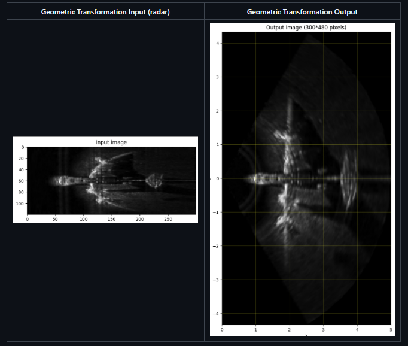

# Personal Projects

<table>
  <tr>
    <td></td>
    <td></td>
  </tr>
  <tr>
    <td align="center">stockTrack - Dashboard</td>
    <td align="center">trackApp - Year Tracking</td>
  </tr>
  <tr>
    <td></td>
    <td></td>
  </tr>
  <tr>
    <td align="center">stockTrack - Overview</td>
    <td align="center">stockTrack - Assets</td>
  </tr>
  <tr>
    <td></td>
    <td></td>
  </tr>
  <tr>
    <td align="center">IoT Project - Architecture</td>
    <td align="center">Bachelor's Thesis - dataflow</td>
  </tr>
  <tr>
    <td></td>
    <td></td>
  </tr>
  <tr>
    <td align="center">Digital Image Processing - Extraction</td>
    <td align="center">Digital Image Processing - Transformations</td>
  </tr>
</table>

A collection of projects that, for various reasons, aren't published as open source.

This repository includes a mix of school projects, personal projects, tools, experiments, tests, and other smaller projects that I've worked on over time.

While the projects in this repository aren't open source, this is intended to showcase some of my work and the kinds of projects I've worked on. The documentation gives an overview of the projects without necessarily exposing their source code.

These projects are not published publicly for various reasons, including:

- **Course policies** – Many courses don't allow students to publish their work, as doing so could make it easier for other students to plagiarize or reuse it.
- **Group projects** – Some projects were completed as group work, meaning publishing them may require permission from the other contributors. In these cases, the documentation focuses on my own contributions and area of responsibility.
- **Future projects** – Some projects may eventually be developed further into SaaS products, so the source code is kept private for now.
- **Small experiments and large files** – Some projects are simply small experiments, prototypes, or projects with large files that aren't particularly useful to publish as a public repository.
- **Code Quality** - Sometimes quick and dirty is enough. In such cases I don't think quality matches my skillset

For example, a school project may have been developed collaboratively with other people. In those cases, I document what I worked on rather than publishing the entire project.

## About

The projects in this repository aren't necessarily maintained or actively developed. Some may be unfinished, outdated, or simply kept here for reference.

For transparency and ease of access, the projects are documented as Markdown files, usually with screenshots and some additional information about what the project is and what it was made for.

The entries are written semi-manually with AI assistance. The information is based on the projects themselves, with AI mainly helping with formatting, wording, and organizing the documentation.

## Projects

Projects are documented individually in their respective Markdown files. Each entry may include:

- A short description
- Screenshots
- Technologies used
- Purpose and background
- Other relevant information

The level of detail varies depending on the project.

## Project Ranking

Rough ranking by overall impressiveness — a mix of complexity, real-world impact, and how much I learned from each.

| # | Project | Why |
|---|---------|-----|
| 1 | **[stockTrack](./stockTrack/README.md)** | Full-stack portfolio tracker with multi-broker support, FIFO tax calculations, Finnish tax PDF export, and CI/CD. |
| 2 | **[trackApp](./trackApp/README.md)** | All-in-one life management platform: notes, calendar, expenses, asset tracking, life scoring, receipt OCR. My fullstack open project. |
| 3 | **[bachelorsThesis](./bachelorsThesis/README.md)** | Fine-tuned LLMs for Nokia, built a full-stack app integrating device inventory + fault tickets + test automation. Thesis submitted to University of Oulu. |
| 4 | **[iotProject](./iotProject/README.md)** | Full-stack IoT monitoring system: Raspberry Pi Pico W + BMP280 sensor, PocketBase backend, real-time WebSocket graphs, sensor sharing & adoption, automated email alerts, Jenkins CI/CD. |
| 5 | **[programmableWebProject](./programmableWebProject/README.md)** | Full-stack budget planner with Kotlin/Spring Boot backend, React + shadcn/ui frontend, Docker Compose deployment with Nginx, and a GDPR auxiliary service. Group project at University of Oulu. |
| 6 | **[ollamaImage](./ollamaImage/README.md)** | Custom Ollama Docker image with CUDA 12 compiled for Pascal GTX 1080 Ti, cross-GPU build pipeline, self-hosted registry, deployed on TrueNAS. |
| 7 | **[distributedSystemsProject](./distributedSystemsProject/README.md)** | Microservice-based EHR platform: Spring Boot + Kotlin, 3-node Cassandra cluster, gRPC audit logging with protobuf, Flask ML risk detection (Random Forest), Docker Compose + Kubernetes orchestration, role-based auth (ADMIN/STAFF/RESEARCHER). Group project 18/20 |
| 8 | **[valueInvestingTemplate](./valueInvestingTemplate/README.md)** | Fundamental stock analysis and valuation toolkit featuring Excel-based reporting, DCF and other financial models, AI-powered equity analysis with Gemini, and a CFTC COT commodity dashboard with Discord alerts. Deployed with Docker Compose and automated via Jenkins CI/CD |
| 9 | **[digitalImageProcessing](./digitalImageProcessing/README.md)** | DIP coursework covering Fourier/frequency-domain filtering, DCT compression, morphological segmentation, geometric transformations, and image restoration — all in Python. Grade 5|
| 10 | **[bigDataProject](./bigDataProject/README.md)** | Processed millions of Yelp reviews with PySpark, ran RoBERTa fake review detection on GPU, graph analytics. Grade 5. |
| 11 | **[socialComputing](./socialComputing/README.md)** | Social Computing coursework: SQL-based social media analysis, LDA topic modelling, VADER sentiment analysis, multi-tier content moderation engine, and a new social feature for the Mini Social Flask platform. Grade 5 |
| 12 | **[computerSystems](./computerSystems/README.md)** | Embedded C project on TI CC2650 SensorTag — a Tamagotchi virtual pet with MPU9250/TMP007/OPT3001/BMP280 sensors, gesture recognition, PWM buzzer melodies, UART backend communication, and a multi-sensor state machine. Group project with Grade 5 |
| 13 | **[universityCppCourse](./universityCppCourse/README.md)** | Comprehensive intermediate C++ coursework: doubly-linked lists with merge sort, separate chaining + linear probing hash tables, inheritance/polymorphism/virtual destructors, Rule of Three, GDB debugging, image compositing with alpha blending, and Makefile authoring. Adapted from UIUC CS 225. Grade 5|
| 14 | **[tira](./tira/README.md)** | Java coursework implementing 9 fundamental data structures and algorithms from scratch — insertion sort, binary search, stack, queue, quicksort/mergesort/heapsort, BST, hash table, and graph algorithms (BFS/DFS/Dijkstra) — integrated into a Swing desktop app. Grade 5. |
| 15 | **[towardsDataMining](./towardsDataMining/README.md)** | Data mining coursework spanning R, MATLAB, Python, and SQL — data exploration, relational databases (MySQL + SQLite), synthetic data generation, sensor data visualization, sampling techniques, and missing data imputation. |

