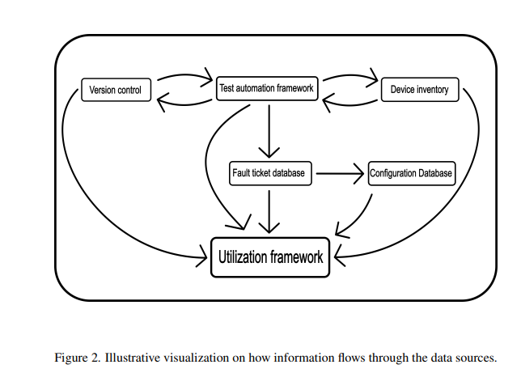
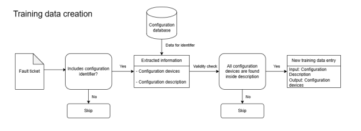
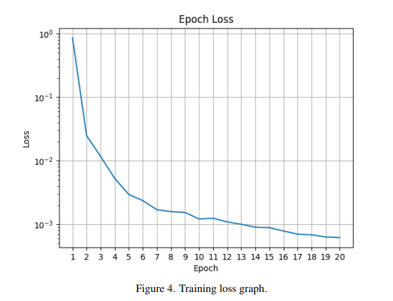
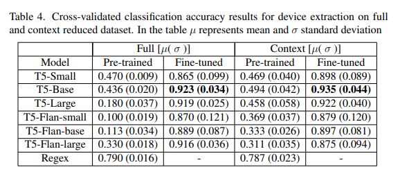
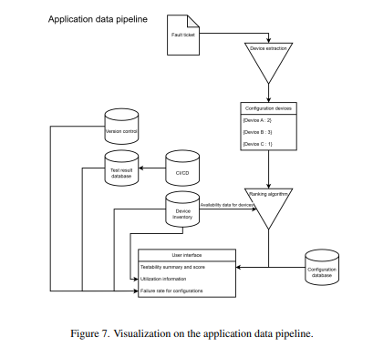
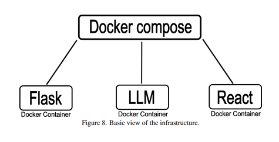

# Employing Device Inventory and Failure Data for Test Configuration Discovery and Device Utilization

> Bachelor's thesis investigating how fault tickets and device inventory data can be used to automatically discover test configurations and improve device utilization in network integration testing. Work done for Nokia during 2025.

## Overview

This thesis explores a two-pronged approach to tackle device capacity constraints in network integration testing. First, it examines methods for interpreting natural language data found in fault tickets — converting unstructured text into structured device configurations using fine-tuned large language models (LLMs). Second, it builds an application that integrates device inventory, test automation, and fault ticket data to automatically identify test configurations, detect reservation conflicts, and calculate device utilization.

## Background & Motivation

This was a Bachelor's thesis for the **Degree Programme in Computer Science and Engineering** at the **University of Oulu**, completed in May 2025. The thesis investigated how to automatically deduce whether we have the devices needed to test fault-related cases. Alongside the LLM research, I built an application that integrates device inventory, fault tickets, test automation, and version control data. During the move from Rusko to Linnanmaa, I helped transition the device inventory system and studied how abstract resources (resource pools) and device permissions should be organized. I also implemented conflict checking to see what was holding up the reservation queue — making it easy to identify blocked topologies and prioritize critical test cases.

## Features

- **LLM-based device extraction** — Fine-tuned T5 models to extract device configurations from fault ticket descriptions with ~94% accuracy
- **Compatibility checking** — GUI to input a fault ticket ID, review extracted devices, and compare against available inventory (green = available, orange = partial, red = unavailable) with a percentage compatibility score
- **Conflict detection** — Search topologies and test cases, fetch current availability, and detect reservation conflicts with time estimates
- **Resource pool awareness** — Handles abstracted resource pools for dynamic device allocation
- **Permission & ownership recommendation** — Analysis and proposal for organizing access rights and ownership in the device inventory

## Screenshots

<table>
  <tr>
    <td></td>
    <td></td>
    <td></td>
  </tr>
  <tr>
    <td></td>
    <td></td>
    <td></td>
  </tr>
</table>

> *Figures are also available in the original thesis PDF.*

## Technologies Used

- **Languages:** Python, TypeScript
- **Frameworks & Libraries:** Flask (backend), React with Vite (frontend), Hugging Face Transformers (T5 models)
- **Models:** T5-Small, T5-Base, T5-Large, Flan-T5-Small, Flan-T5-Base, Flan-T5-Large
- **Infrastructure:** Docker (3 containers — frontend, backend, LLM), Docker networking with Docker DNS
- **Other:** Regex (baseline), scikit-learn (evaluation), K-fold cross-validation

## Key Takeaways

- Fine-tuning a relatively small model (T5-base) outperformed Regex by over 10%, achieving 94% accuracy — proving that compact LLMs can be highly effective for domain-specific structured data extraction with limited training data.
- Context reduction of fault ticket text slightly improved model performance, even though the dataset mostly consisted of short descriptions.
- The fine-tuned model learned structured output formatting almost perfectly — a significant advantage over Regex.
- A three-container Docker architecture (frontend / backend / LLM) provided clean separation for scaling, maintenance, and security.
- The device inventory's flexible permission system is powerful but needs a standardized approach before larger team adoption to avoid complexity issues.
- Working on a high-performance computing platform with multiple 100 GB GPUs was a unique opportunity that I wouldn't have had without doing this thesis at Nokia.
- Integrating different data sources into a cohesive system was both challenging and rewarding — stitching together device inventory, fault tickets, test automation, and version control data into one application was one of the most interesting parts of the project.

## Status

- **Completed:** Yes
- **Maintained:** No
- **Notes:** Thesis submitted and accepted in May 2025. Available in https://oulurepo.oulu.fi/handle/10024/55636

## My Contributions

> *This was a solo project.*

## Links

- [Thesis PDF](./nbnfioulu-202505073143.pdf)
- **University:** University of Oulu, Faculty of Information Technology and Electrical Engineering
- **OuluRepo:** https://oulurepo.oulu.fi/handle/10024/55636

## Further Notes

This document was initially generated by providing the thesis PDF to an AI, which produced a reasonably good starting point. The content was then reviewed, improved, and verified.

