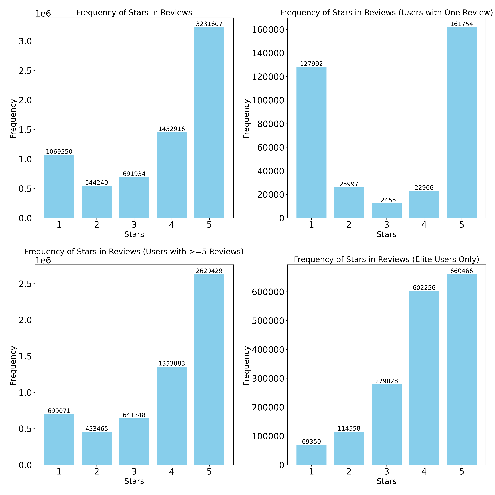
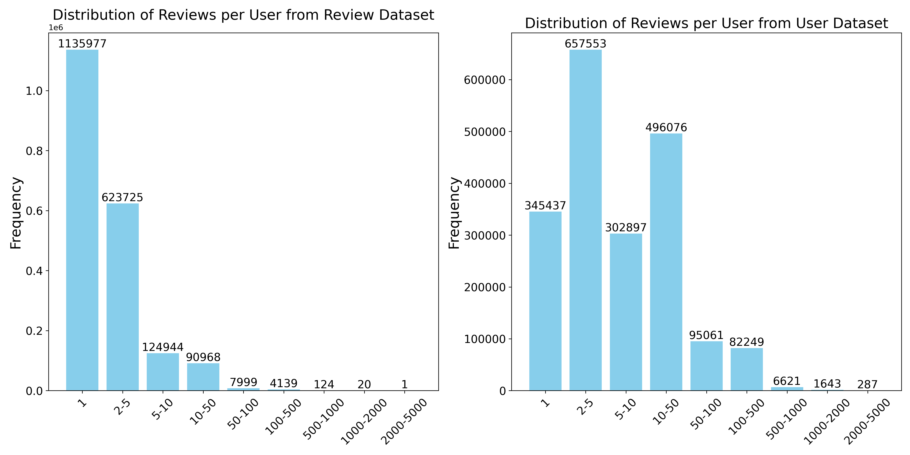
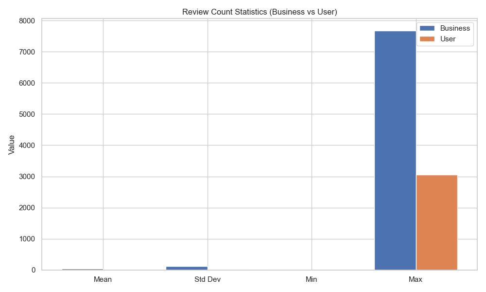
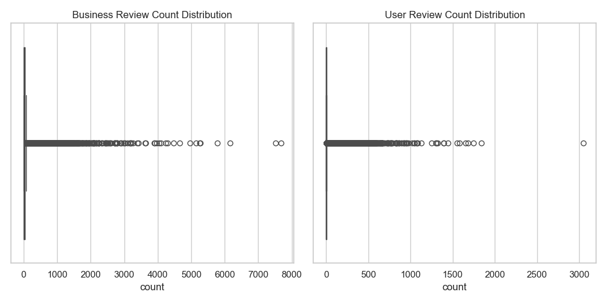
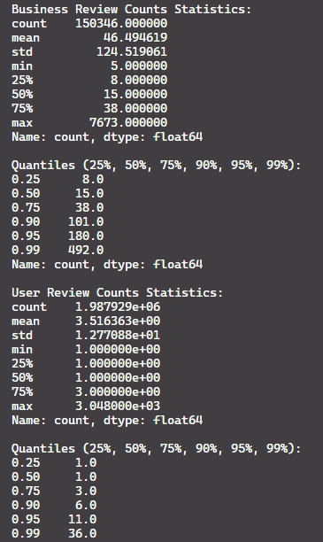
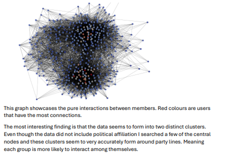

# Big Data Project — Yelp Dataset

Group project analyzing the [Yelp Academic Dataset](https://www.yelp.com/dataset) with Apache Spark and some machine learning, plus individual exercise reports. Grade: 5.

## Background

Course project for a Big Data class. The group part used PySpark to process millions of Yelp reviews, users, and businesses. The individual exercises covered Spark fundamentals, structured streaming, ML pipelines, and graph analytics.

## Group Project Features

- **Fake Review Detection** — Labels reviews as Fake/Real using a RoBERTa OpenAI text detector, processed millions with GPU
- **Fake Review Analysis** — Star distributions, yearly trends, elite user overlap in fake reviews
- **Distribution Analysis** — Dataset sizes, star rating distributions, review counts per user/business
- **Elite User Patterns** — Rating behavior before and after getting Yelp's elite badge; linear regression on rating factors
- **Hypothesis Testing** — Bootstrap testing to see if 1-review users rate differently than 5+ review users
- **Review Statistics** — Per-business and per-user review count stats with charts

## Screenshots

## Individual Exercise Reports

Four individual exercise reports submitted alongside the group project:

- **Exercise 1** — Spark lazy evaluation, Spark vs Pandas comparison, Matplotlib visualizations (rainfall and temperature data)
- **Exercise 2** — Spark structured streaming, watermarking for late data, DStream vs DataFrame APIs
- **Exercise 3** — ML Pipelines with PySpark, hyperparameter tuning, feature engineering for temperature prediction (improved R² from 0.23 to 0.82)
- **Exercise 4** — Graph analytics on a Congress Twitter interaction dataset (SNAP), PageRank analysis revealing two political clusters

## Tools & Technologies Used

- Python, PySpark, pandas, NumPy, SciPy
- HuggingFace Transformers, PyTorch (CUDA), RoBERTa
- Matplotlib
- Jupyter Notebook

## Key Takeaways

- Processed millions of Yelp records with PySpark (JSON, joins, aggregations)
- Used a RoBERTa transformer to detect fake reviews at scale on GPU
- Found star rating differences between 1-review and 5+ review users (bootstrap testing)
- Elite users tend to give higher ratings after getting the badge
- Self-hosted PySpark on my server for easier development

### Exercises

- Learned Spark streaming with watermarking for late data handling
- Improved ML model accuracy from R² 0.23 → 0.82 with feature engineering (hour/month features, interaction terms)
- Analyzed Congress Twitter graph with PageRank — found clear partisan clusters

## Status

- **Completed:** Yes
- **Maintained:** No
- **Notes:** Dataset not included (too large). Download from Yelp separately.

## My Contributions

- Fake review detection pipeline (RoBERTa integration)
- Fake review analysis notebook
- Distribution analysis notebook
- Project report
- All 4 individual exercise reports (Spark fundamentals, streaming, ML pipelines, graph analytics)

## Links

- [Yelp Dataset](https://www.yelp.com/dataset)
- [RoBERTa Detector](https://huggingface.co/roberta-base-openai-detector)

## Further Notes

This document was initially generated by providing the project repo and my personal exercise reports to an AI. The output was then edited and verified.

