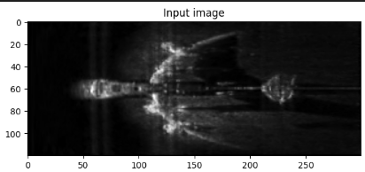
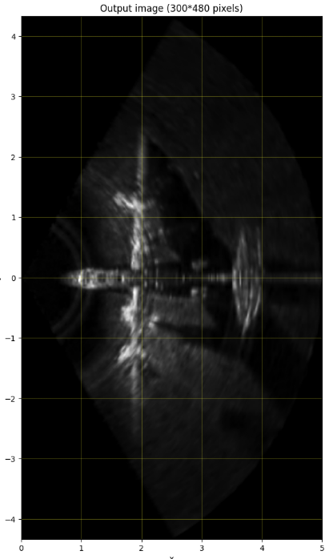
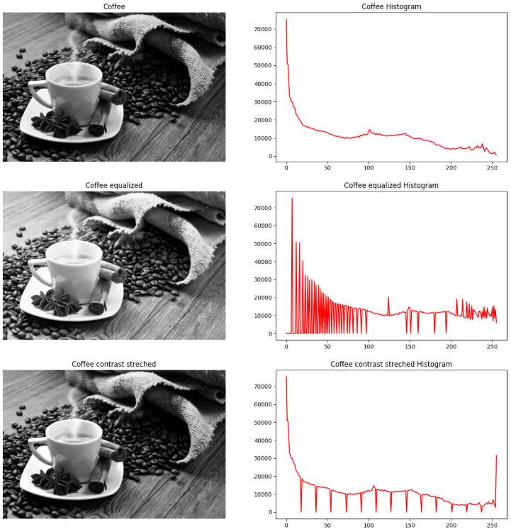
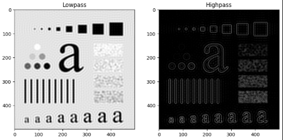
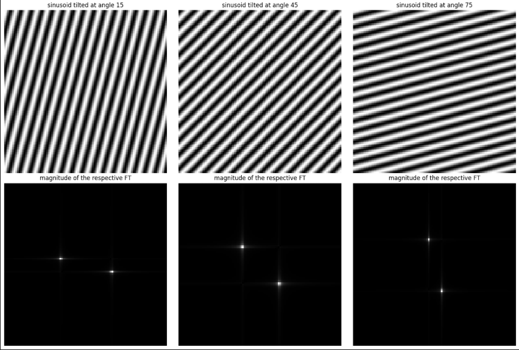
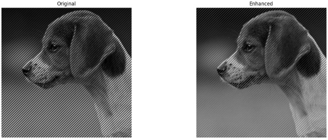
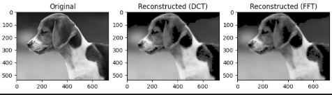

# digitalImageProcessing

A collection of programming assignments for the **Digital Image Processing (DIP)** course at the University of Oulu. Completed as part of the course curriculum, covering fundamental and advanced image processing techniques — from pixel adjacency to frequency domain filtering, image restoration, compression, and segmentation.

## Background & Motivation

This repository contains my coursework for the DIP course, where we explored both the theory and practical implementation of image processing algorithms. The assignments were completed in pairs using Jupyter Notebooks with Python. Each assignment builds on the previous, forming a comprehensive portfolio of image processing techniques — from low-level pixel operations to advanced morphological segmentation.

## Assignments

### Assignment 1 — Image Topology and Geometric Transformations

- Pixel adjacency and connectivity (4-adjacency vs 8-adjacency)
- Connected component labeling using `skimage.measure.label()`
- Region detection with seed pixels and color labeling
- Geometric transformations with `warp2d` (curvilinear mapping)

| Geometric Transformation Input (radar) | Geometric Transformation Output |
|---|---|
|  |  |

### Assignment 2 — Intensity Transformations and Spatial Filtering

- Histogram analysis, equalization, and stretching
- Spatial domain image sharpening (Laplacian)
- Comparison of contrast enhancement techniques

| Histogram Equalization |
|---|
|  |

### Assignment 3 — Frequency Domain Processing

- Fourier Transform (FT) computation using `scipy.fftpack`
- Ideal and Gaussian lowpass / highpass filtering
- Bandpass filtering in the frequency domain

| Filtering Results |
|---|
|  |

### Assignment 4 — Image Restoration and Color Processing

- Noise reduction in spatial domain (mean filter, median filter)
- Additive Gaussian noise analysis and RMSE evaluation
- Periodic noise removal using band-reject filtering
- Color image processing in different color spaces

| Sinusoid Analysis | Sinusoid Enhancement |
|---|---|
|  |  |

### Assignment 5 — Image Compression

- DCT-based block transform coding (8x8 blocks)
- Coefficient removal (thresholding smallest coefficients)
- Image reconstruction via inverse DCT
- Comparison with DFT-based compression

| DCT Compression Results |
|---|
|  |

### Assignment 6 — Image Morphology and Segmentation

- Global thresholding using an iterative algorithm (mean gray value initialization)
- Morphological operators (erosion, dilation, opening, closing)
- Watershed segmentation

| Connected Component Extraction |
|---|
|  |

## Technologies Used

- **Language:** Python
- **Image Processing:** scikit-image (skimage), scipy (ndimage, signal, fftpack)
- **Data Manipulation:** NumPy
- **Visualization:** Matplotlib
- **Environment:** Jupyter Notebooks (.ipynb)
- **Other:** scipy.fft (DCT/IDCT), scikit-image filters and morphology

## Key Takeaways

- Gained hands-on experience with **scikit-image** and **SciPy** for image processing tasks.
- Implemented an **iterative global thresholding algorithm** from scratch.
- Developed a **DCT-based image compression algorithm** using 8×8 blocks, DCT, coefficient removal, and inverse DCT.
- Worked with **Fourier Transforms** and frequency-domain filters, including ideal and Gaussian lowpass/highpass filters.
- Analyzed **image noise** and compared RMSE values before and after applying mean and median filters.
- Implemented **connected component labeling** using 4- and 8-connectivity to identify different regions in images.
- Improved **Python and NumPy** skills through array operations, slicing, broadcasting, histograms, and image data processing.
- Worked on **pair programming** using VS Code Server.

## Status

- **Completed:** Yes (course assignments finished, grade 5)
- **Maintained:** No (archive — coursework reference)
- **Notes:** This repository serves as a reference for fundamental image processing techniques. The assignments were graded as part of the DIP course at the University of Oulu.

## My Contributions

> *Coursework completed in a two person group*

## Links

- Uses [scikit-image](https://scikit-image.org/)
- Uses [scipy](https://scipy.org/)
- Uses [NumPy](https://numpy.org/)
- Uses [Matplotlib](https://matplotlib.org/)
- Course: Digital Image Processing, University of Oulu

## Further Notes

This document was created by giving an AI access to the source code. The report was then edited and verified.

