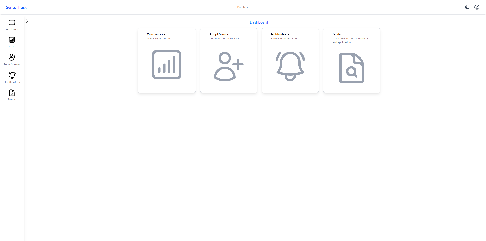
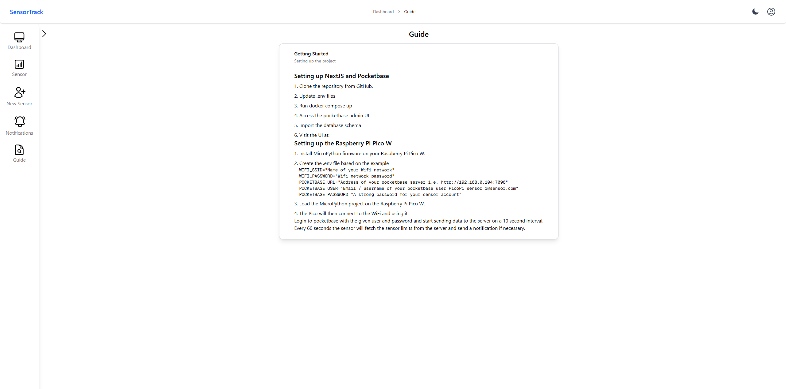
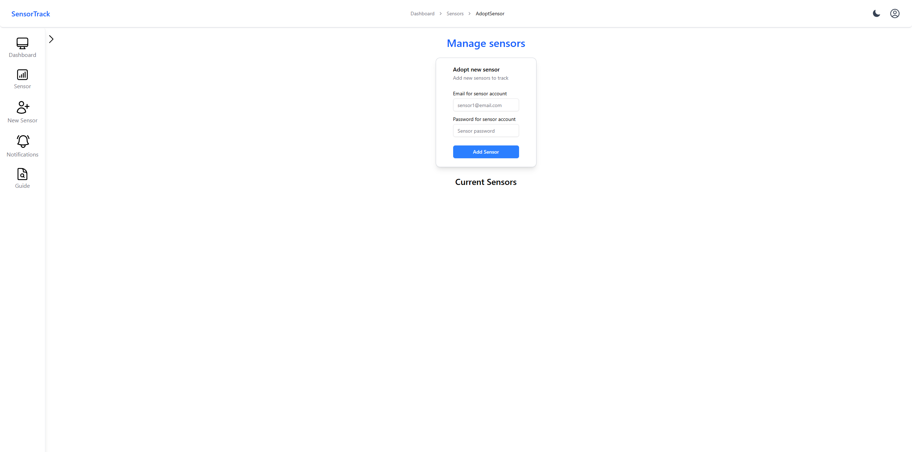

# IoT Project — Temperature & Pressure Monitoring with Raspberry Pi Pico W

A full-stack wireless IoT monitoring system that collects temperature and pressure data from a **BMP280 sensor** connected to a **Raspberry Pi Pico W**, stores it in **PocketBase**, and visualizes it in real-time through a **Next.js** dashboard. Built as a group project for an IoT course at the University of Oulu.

## Background & Motivation

Course project for an IoT class. The goal was to build a complete IoT system — from the physical sensor and microcontroller all the way up to a web dashboard with real-time updates, notifications, and user management. The system uses a Raspberry Pi Pico W running MicroPython to read a BMP280 sensor, sending data over Wi-Fi to a PocketBase backend, which is then consumed by a Next.js frontend with live WebSocket-based updates.

## Features

- **Physical sensor data collection** — Raspberry Pi Pico W reads temperature and pressure from a BMP280 sensor every 5 seconds
- **Real-time data streaming** — Live sensor data pushed to the frontend via WebSockets
- **Live temperature & pressure graphs** — Daily line charts using Recharts, updated in real-time from WebSocket data
- **Sensor limits & notifications** — Configurable temperature upper/lower limits per sensor; automatic email alerts when limits are exceeded using PocketBase hooks
- **Sensor adoption system** — Users can wirelessly "adopt" sensors by registering them, enabling shared access to sensor data between users
- **Multi-sensor support** — View all available sensors and their data on a single dashboard page. Also share sensors between users.
- **Historical data graphs** — 7-day daily average overview per sensor (server-side SQL aggregation)
- **Notification history** — Table view of all notifications with sensor name, title, description, receivers, and timestamps
- **User authentication** — Full auth flow with PocketBase (login, register, session management, middleware-protected routes)
- **CI/CD pipeline** — Automated Docker-based deployment and testing via Jenkins with GitHub webhooks
- **Test automation** — Selenium-based integration tests in a Docker container verifying registration, login, and data flow
- **Guide page** — In-app guide showing how to set up the Raspberry Pi Pico W sensor and configure the application

## Screenshots

| Architecture Diagram |
|---|
|  |

| Dashboard Home | Guide Page | Adopt Sensor |
|---|---|---|
|  |  |  |

### Data Flow

1. **Raspberry Pi Pico W** — Runs MicroPython, connects to Wi-Fi, reads BMP280 sensor data (temperature & pressure) every 5 seconds, and POSTs it to PocketBase via REST API
2. **PocketBase** — Backend-as-a-service storing sensor data, user accounts, sensor limits, and notifications. Custom JS hooks handle email alerts and custom API endpoints (adoptSensor, sensorDailyOverview)
3. **Next.js Frontend** — Server-rendered pages with client-side real-time components. WebSocket connections stream new sensor data directly to Recharts line charts
4. **CI/CD (Jenkins)** — Automatic build, deploy, and test pipeline on every GitHub push. Selenium tests verify core flows (registration, login)

### Hardware

- **Raspberry Pi Pico W** — Microcontroller with onboard Wi-Fi
- **BMP280 Sensor** — Temperature and pressure sensor connected via I²C (SDA pin 0, SCL pin 1)
- Power via USB

### PocketBase Schema

- **users** — Auth collection for both human users and sensor accounts
- **sensorData** — Temperature & pressure readings with timestamps, linked to sensor user
- **sensorLimits** — Per-sensor upper/lower temperature limits for alerting.
- **notifications** — Alert records with title, description, and comma-separated receiver emails
- **sharedAccounts** — Junction table linking human users to adopted sensor accounts

## Technologies Used

- **Hardware:** Raspberry Pi Pico W, BMP280 sensor, I²C protocol
- **Sensor Firmware:** MicroPython, custom libraries (BMP280 driver, Wi-Fi connection, PocketBase client)
- **Backend:** PocketBase (Go-based, SQLite, REST API + real-time subscriptions)
- **Frontend:** Next.js 15 (App Router, Turbopack), React 19, Tailwind CSS 4, ShadCN UI
- **Charts:** Recharts
- **Real-time:** WebSockets via `next-ws`
- **State Management:** Zustand
- **PocketBase Hooks:** JavaScript (custom API routes, email sending, database queries)
- **Testing:** Python, pytest, Selenium (undetected-chromedriver)
- **CI/CD:** Jenkins, Docker, Docker Compose, GitHub webhooks
- **Deployment:** Docker containers (pocketbase, frontend, test-automation), bind mounts for data persistence

## Key Takeaways

- Built a **complete end-to-end IoT system** from physical hardware to real-time web dashboard — this was a rewarding projects because everything had to work together: the sensor firmware, the network connection, the backend, and the frontend.
- Learned **MicroPython** for embedded development on the Raspberry Pi Pico W, including I²C communication with the BMP280 sensor and custom library imports.
- Implemented a **custom environment variable loader** (`environment.py`) for the Pico W since MicroPython doesn't include `python-dotenv`.
- The **sensor adoption system** was an interesting design challenge — each physical sensor is represented as a PocketBase user account, and human users can "adopt" sensors via a custom API endpoint. The PocketBase hooks system was surprisingly powerful for this.
- Used **PocketBase JS hooks** extensively — custom API routes (`/api/adoptSensor`, `/api/sensorDailyOverview`), email notifications via `MailerMessage`, SQL queries with `$app.db().newQuery()`, and `onRecordAfterCreateSuccess` for automated alerting.
- Set up a **WebSocket-based real-time data pipeline** using `next-ws` — the frontend subscribes to live sensor updates and renders them on Recharts line charts without page refreshes.
- The **CI/CD pipeline** was set up with Jenkins and Docker, running Selenium tests that wait for PocketBase and frontend services to be healthy before executing test cases.
- **Multi-container Docker architecture** with health checks and Docker DNS resolution made the deployment reliable — the test automation container waits for services to be up before running.
- The project reinforced the importance of **modular code organization** on the Pico W side — separating the BMP280 driver, Wi-Fi connection logic, and PocketBase API client into reusable libraries.
- This was a **group project**, and coordinating the division of work between the hardware/firmware side and the web application side was a valuable experience.

## Status

- **Completed:** Yes (course project finished, full points for the project)
- **Maintained:** No (archive — coursework reference)
- **Notes:** The project uses `next-ws` for WebSocket support which requires a custom Next.js server configuration. The repository also served as the basis for the [NextPB-Auth-Starter](https://github.com/V-vTK/NextPB-Auth-Starter) template project.

## My Contributions

> This was a two-person group project for an IoT course at the University of Oulu. I was responsible for:
> 
> - Building the **web application** — PocketBase backend, Next.js frontend, ShadCN UI components, Recharts real-time graphs
> - Custom **PocketBase JS hooks** — adoptSensor API, email notifications
> - **CI/CD pipeline** — Jenkins configuration, Docker Compose setup, Selenium test automation
> - **Guide page** and documentation for setting up the Raspberry Pi Pico W sensor
>
> On the hardware side, I contributed to the MicroPython firmware alongside the rest of the group.

## Links

- Inspired by / uses [PocketBase](https://pocketbase.io/)
- Uses [ShadCN UI](https://ui.shadcn.com/) component library
- Uses [Next.js](https://nextjs.org/)
- Starter template derived from this project: [NextPB-Auth-Starter](https://github.com/V-vTK/NextPB-Auth-Starter)
- CI/CD setup: [DinD-Jenkins](https://github.com/V-vTK/DinD-Jenkins)

## Further Notes

This document was created by providing the project repository to an AI. The output was then edited and verified.

