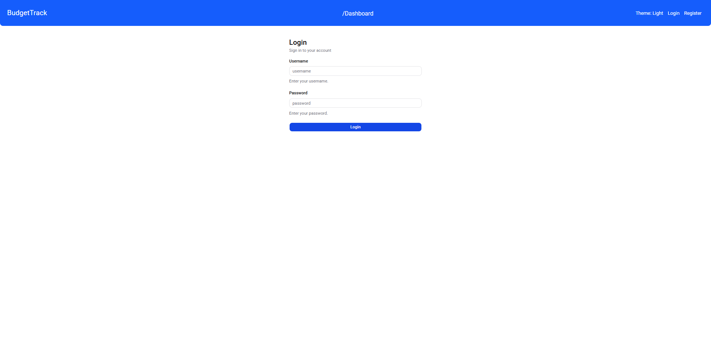
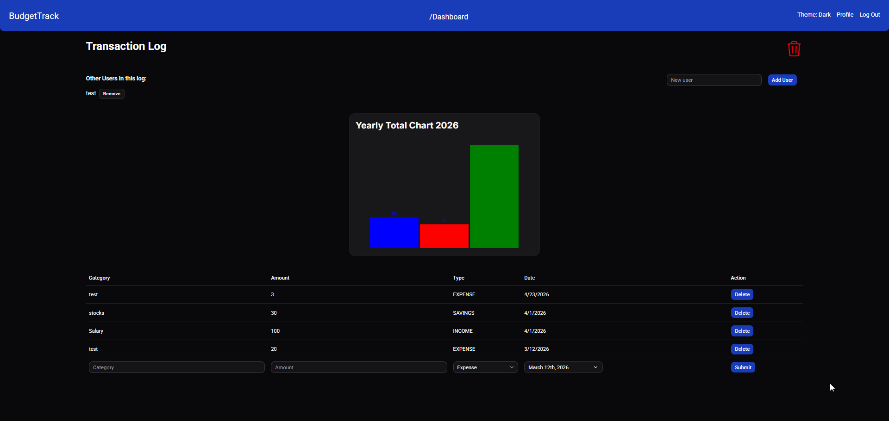
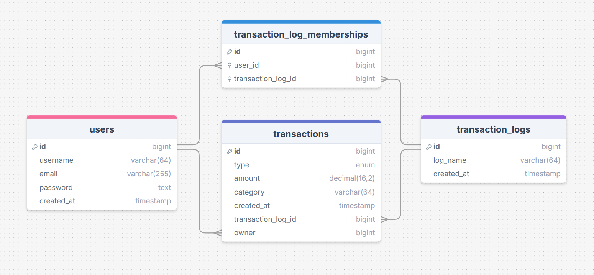
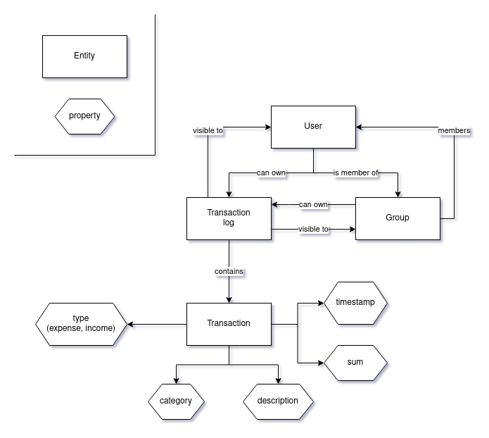

# Programmable Web Project — Budget Planner

A full-stack **budget planner** web application developed as a group project for the **Ohjelmoitava Web (Programmable Web / PWP)** course at the **University of Oulu**. The project was built iteratively across five deadlines, covering the full lifecycle of a modern web API — from design and database modeling to implementation, documentation, deployment, and client development.

## Project Structure

The project consists of several components working together:

| Component     | Technology                          | Purpose                                              |
|---------------|-------------------------------------|------------------------------------------------------|
| **Backend API**  | Kotlin, Spring Boot 4.1, Java 25 | RESTful API for budget tracking                      |
| **Frontend**     | React, TypeScript, Vite, shadcn/ui | Web-based client for the API                         |
| **Auxiliary Service** | Kotlin, Gradle              | GDPR data export service                             |
| **Nginx**        | Nginx                              | Reverse proxy, static content, TLS termination       |

## Screenshots

### Login Screen

### Transaction Dashboard

### Database Schema

### Entity Relationship Diagram

## Technologies

### Backend

- **Kotlin** with Spring Boot 4.1 (snapshot)
- **Java 25**
- **Gradle** with Kotlin DSL
- **Spring Security** for authentication and authorization
- **Spring Data JPA** with H2 file-based database
- **Caffeine** caching
- **SpringDoc OpenAPI** for API documentation (Swagger UI)
- **WebSocket** support
- **JaCoCo** for test coverage
- **ktlint** for Kotlin linting

### Frontend

- **React 19** with TypeScript
- **Vite 7** as build tool
- **shadcn/ui** component library
- **Tailwind CSS 4**
- **TanStack React Query** for server state management
- **React Router v7** for routing
- **Recharts** for transaction charts and visualizations
- **Sonner** for toast notifications
- **ESLint** and **Prettier** for code quality

### DevOps & Deployment

- **Docker Compose** for orchestrating backend, frontend, Nginx, and auxiliary service
- **Nginx** as web server and reverse proxy
- Deployed in self-hosted server

## Key Features

- **User authentication** — Register and log in to manage personal budgets
- **Transaction logs** — Create named logs to organize transactions by category or purpose
- **Transaction management** — Add, view, and filter income/expense transactions
- **Dashboard** — Overview of all transaction logs with quick access
- **Charts** — Visual breakdown of transactions using Recharts
- **Caching** — Server-side caching with Caffeine for frequently accessed data
- **Security** — Role-based access control, password hashing
- **GDPR export** — Auxiliary service for exporting user data
- **API documentation** — Full OpenAPI/Swagger documentation with response examples and error codes
- **Dockerized deployment** — Complete Docker Compose setup with isolated networking

## My Contributions

As a member of a three-person team, I was primarily responsible for:

1. **Deployment** — Dockerized the entire ecosystem (backend, frontend, auxiliary service, Nginx) using Docker Compose; deployed to my server along with monitoring and control systems (portainer)
2. **Frontend (React client)** — Built the complete web client with React, TypeScript, and shadcn/ui, including dashboard, transaction management, authentication flows, charts, and responsive UI
3. **API Documentation** — Authored some of the OpenAPI specification with proper structure, response examples, error codes, and request body schemas
5. **Schema Validation** — Ensured proper request validation on API endpoints
6. **Architecture & Infrastructure** — Designed the deployment architecture diagram and documented tools and frameworks

## Grade / Status

The project was developed as part of the University of Oulu course curriculum. The grading criteria covered API design, database implementation, API implementation, documentation, deployment, and client/auxiliary service development. Nearly full points for the project and course grade of 5

## Course Exercises

The repository also includes individual course exercises (PWP-Exercises) with Flask-based Python APIs covering the full spectrum of REST API development. Below are the key concepts covered, drawn directly from the course material:

### REST Fundamentals

- **Resources** — Data exposed through the API, categorized as *collection* types (lists of items) and *item* types (individual resources). There doesn't have to be a 1:1 mapping between database models and resources.
- **Addressability** — Every resource must be uniquely identifiable by a URI. URIs follow a hierarchical tree structure (e.g. `/api/sensors/{sensor}/measurements/{measurement}/`). Multiple URIs can point to the same resource when it has multiple logical owners.
- **Uniform Interface** — Actions are expressed through HTTP methods: `GET` (fetch, idempotent), `PUT` (full replace, idempotent), `POST` (create child resource, not idempotent), `DELETE` (idempotent), and `PATCH` (non-standard, API-specific semantics).

### Flask-RESTful Implementation

- **Resource classes** — Inherit from `Resource`, implement methods named after HTTP verbs (`get`, `post`, `put`, `delete`). Routed via `api.add_resource(ClassName, "/api/path/")`.
- **Reverse routing** — Generate URIs programmatically with `api.url_for(ResourceClass, **kwargs)` instead of hardcoding paths.
- **Multiple routes** — Register the same resource class under multiple URI templates for different resource hierarchies.

### URL Converters

- **Custom converters** — Extend Werkzeug's `BaseConverter` to define `to_python` (URI string → model instance) and `to_url` (model instance → URI string). Registered via `app.url_map.converters["name"] = MyConverter`.
- **Consistency vs overhead** — Converters reduce boilerplate but may fetch model instances that aren't strictly needed. Trade-off between code consistency and performance.

### Serialization & Deserialization

- **Model serialization** — `serialize()` methods on model classes convert instances to JSON-compatible dictionaries. Support *short form* (limited fields for collections) and *long form* (all fields for item resources).
- **Embedded relationships** — Foreign key references can be serialized as a simple identifier or as an embedded short-form representation of the related resource.
- **Deserialization** — `deserialize(doc)` methods populate model fields from a dictionary. Use key lookup (`doc["required"]`) for mandatory fields and `.get()` for optional fields.
- **Datetime handling** — Serialize to ISO 8601 with `.isoformat()`, deserialize with `datetime.fromisoformat()`.

### JSON Schema Validation

- **Schema definition** — Static methods on model classes define the expected JSON structure with type constraints, required fields, and format specifiers.
- **Validation** — Use `jsonschema.validate()` with `draft7_format_checker` for format-aware validation (e.g. `date-time` strings). Returns 400 with the validation error description on failure.
- **Single source of truth** — Schemas are defined once on the model and reused across both `POST` (create) and `PUT` (update) endpoints.

### Server-Side Caching

- **Cache backends** — `FileSystemCache` (disk-based, persistent), `SimpleCache` (in-memory dictionary), and `NullCache` (no-op). Configured via `CACHE_TYPE`, `CACHE_DIR`, and `CACHE_DEFAULT_TIMEOUT`.
- **View caching** — `@cache.cached()` decorator caches responses using `request.path` as the key. For query-parameter-dependent resources, supply a custom `make_cache_key` function.
- **Manual caching** — Fine-grained control with `cache.set(key, value)` and `cache.get(key)`. Useful when caching decisions depend on the response content (e.g. only cache full pages).
- **Cache invalidation** — Clear individual keys with `cache.delete(key)`, multiple keys with `cache.delete_many()`, or nuke everything with `cache.clear()`. Cache keys are typically formed using `api.url_for()` and `request.path`.

### API Authentication

- **API keys over sessions** — REST APIs are stateless, so authentication uses API keys sent with every request (typically via a custom header like `X-Api-Key`), not session cookies.
- **Key registry** — A database table stores hashed API keys (using SHA256 — a more secure algorithm like bcrypt should be used in production) alongside privilege information (admin flags, resource ownership).
- **Decorator-based access control** — Custom decorators (`@require_admin`, `@require_sensor_key`) validate keys before allowing access to resource methods. Uses `secrets.compare_digest()` for timing-safe comparison.
- **Secure transport** — API keys are only as safe as the transport layer — always use HTTPS in production.

### API Documentation with OpenAPI

- **OpenAPI structure** — The root document contains required fields: `openapi` (version, e.g. `3.0.4`), `info` (metadata, title, version, description, contact, license), `servers` (base URLs), and `paths` (the main portion documenting every URI).
- **YAML over JSON** — YAML is the preferred format for OpenAPI documents due to its lower syntactic noise (indentation-based blocks, no mandatory quotes, no trailing commas). Supports literal (`|`) and folded (`>`) style for multiline strings.
- **Components object** — A centralized storage for reusable objects: `schemas` (JSON schema definitions), `parameters` (path/query/header parameters), `responses`, `requestBodies`, `examples`, `headers`, and `securitySchemes`. Referenced elsewhere via `$ref: '#/components/section/name'`.
- **Parameter object** — Describes URI variables with `name`, `in` (path/query/header/cookie), `description`, `required` (always `true` for path params), and a `schema` defining the type.
- **Path object & operations** — Each path maps to an object containing `parameters` and operation objects for each HTTP method. Operations include `description`, `responses` (required, mapping status codes to response objects), `parameters`, `requestBody`, and `security`.
- **Response examples** — Provide at least one example response body per status code. Use `examples` (mapping of named examples) for multiple variations (e.g. deployed sensor vs. stored sensor), or `example` for a single sample. Include `headers` for status codes like 201 (e.g. `Location` header).
- **Schema references** — Schemas, parameters, and request bodies can be defined once in `components` and referenced with `$ref`, reducing duplication and ensuring documentation stays consistent with the implementation.

### Swagger with Flasgger

- **Basic setup** — Initialize Swagger with a template YAML file via `Swagger(app, template_file="doc/api.yml")`. Documentation becomes viewable at `/apidocs/` after configuration.
- **Docstring documentation** — Embed the entire operation object inside a view method's docstring, separated by `---`. Flasgger picks it up and maps it to the correct path automatically from the route registration.
- **Separate YAML files** — Place operation objects in individual `.yml` files and attach them with the `@swag_from("path/to/file.yml")` decorator. Auto-discovery is possible by setting `doc_dir` in the Swagger config and following the `/{ClassName}/{method}.yml` naming convention.
- **Modular approach** — The template file holds reusable components (schemas, parameters, security schemes), while individual operation documentation lives close to the code (in docstrings or separate files), improving maintainability.

### WSGI Servers & Application Servers

- **Gunicorn** — A Python WSGI HTTP server using a pre-fork model (worker processes spawned at launch). Run with `gunicorn -w 3 "module:create_app()"` where `-w` sets the worker count (typically 2 per CPU core + 1).
- **Why not Flask's dev server** — Flask's built-in server is single-process and unsuitable for production. A dedicated WSGI server like Gunicorn provides parallelism for I/O-bound operations (database access, socket reads).

### Process Management with Supervisor

- **Daemonization** — Supervisor automatically starts, restarts, and manages application processes. Configured via `.conf` files in `/etc/supervisor/conf.d/` defining the program command, user, auto-start/restart policies, and log file paths.
- **System user isolation** — Create a dedicated system user (e.g. `sensorhub`) with minimal privileges to run the application. The virtual environment, project files, and database are all owned by this user, limiting the blast radius of security vulnerabilities.
- **Postactivate scripts** — Shell scripts that activate the virtual environment and set environment variables (e.g. `GUNICORN_WORKERS`), used by both manual testing and Supervisor as a single source of launch configuration.

### NGINX as Reverse Proxy

- **Why a reverse proxy** — Non-root users cannot bind to low-numbered ports (80/443). NGINX sits on these ports, handles static file serving, TLS termination, and forwards dynamic requests to Gunicorn via `proxy_pass`.
- **Configuration structure** — Site configurations go in `/etc/nginx/sites-available/`, enabled via symbolic links in `/etc/nginx/sites-enabled/`. An `upstream` block defines the Gunicorn backend (e.g. `server 127.0.0.1:8000`), and a `server` block defines `listen`, `server_name`, `location` (static files), and `@proxy_to_app` (dynamic request forwarding with headers like `X-Forwarded-For`, `X-Forwarded-Proto`, `Host`).
- **Security headers** — A `default_server` block with `return 444` prevents host spoofing by immediately closing connections with unmatched `Host` headers.

### Docker Deployment

- **Dockerfile basics** — Key instructions: `FROM` (base image, prefer `alpine` variants for minimal size), `WORKDIR` (working directory), `COPY` (files into the image), `RUN` (build-time commands, chained with `&&` to reduce layers), and `CMD` (runtime command in exec format). Gunicorn must bind to `0.0.0.0` inside containers.
- **Container runtime** — Port mapping (`-p host:container`) exposes the application, volume mounts (`-v host:container`) persist data (e.g. SQLite database), and `--restart unless-stopped` enables automatic recovery. Background mode (`-d`) keeps the container running after the terminal closes.
- **Multi-container setup** — NGINX and Gunicorn run in separate containers within the same pod, communicating over an internal network. Docker Compose orchestrates multiple services with port mappings, environment variables, network definitions, and volume mounts.

### Kubernetes & OpenShift (Rahti)

- **Core resources** — A `Deployment` defines container specs (images, ports, environment variables, volume mounts), `Service` routes traffic to pods (NodePort for local testing), and `Route` (OpenShift) exposes the service to the internet with TLS termination.
- **Persistent volumes** — `PersistentVolumeClaim` (PVC) stores data (e.g. SQLite databases) that survives pod restarts. Mounted into containers via `volumeMounts` in the deployment spec.
- **ConfigMaps & Secrets** — ConfigMaps hold non-sensitive configuration (e.g. `config.py` files mounted as volumes), while Secrets hold sensitive values (database passwords, API keys) injected as environment variables or mounted files.
- **External databases** — PostgreSQL instances from CSC Pukki are configured via environment variables (`DB_USER`, `DB_PASS`, `DB_HOST`, `DB_NAME`) set from Secrets. The Flask app reads these to build the `SQLALCHEMY_DATABASE_URI` at runtime.
- **NGINX on OpenShift** — The NGINX image must be configured to run as a non-root user: listen on port 8080, adjust file permissions with `chmod g+rwX`, and comment out the `user` directive. Server names in Rahti are long, so `server_names_hash_bucket_size` needs to be increased.

### API Clients with Python Requests

- **HTTP requests** — The `requests` library provides functions for each HTTP method: `requests.get()`, `requests.post()`, `requests.put()`, `requests.delete()`. The `json` keyword argument sends a Python dictionary as a JSON request body. Responses are parsed with `resp.json()` and headers accessed via `resp.headers["Location"]`.
- **Sessions** — `requests.Session()` reuses TCP connections across multiple requests and supports persistent headers (e.g. `Accept`, authentication tokens). Use as a context manager (`with requests.Session() as s:`) to ensure proper cleanup.
- **Generic client class** — Encapsulate API communication in a class with convenience methods (e.g. `get_maps()`) that call internal `_get`, `_post`, `_put`, `_delete` methods. This centralizes URI knowledge, making the client resilient to API changes.
- **Context manager support** — Implement `__enter__` and `__exit__` on the client class to enable `with APIDataSource(host) as api:` syntax, ensuring the underlying session is always closed.
- **File synchronization** — Compare local and remote data using equality checks (`__eq__`/`__hash__` on model objects). Determine which files are new, changed, or deleted on each side, then apply the appropriate API calls (POST, PUT, DELETE) to synchronize state.
- **Binary file transfer** — Use Base64 encoding (`base64.b64encode(content).decode("utf-8")`) when sending binary data via JSON APIs. Compute file checksums with `hashlib.md5(content).hexdigest()` to detect changes. Track modification times using `os.stat(path).st_mtime`.
- **Secrets management** — Never hardcode credentials. Use environment variables (`os.environ.pop("KEY")`) or configuration files (with restricted permissions) to supply API keys, passwords, and certificate paths.

### TLS & Certificate Authentication

- **CA certificates** — The server's identity is verified using a CA certificate file passed to `ssl.create_default_context(cafile=path)`. For self-signed certificates, set `verify_mode = ssl.CERT_NONE` and `check_hostname = False`.
- **Peer verification (mTLS)** — The server can require clients to present a certificate signed by the same CA. Generate a client key (`openssl ecparam`) and CSR (`openssl req`), have it signed by the CA, then load the cert chain with `context.load_cert_chain(certfile, keyfile)`.
- **Pika SSL setup** — Pass the SSL context to Pika via `pika.SSLOptions(context)` in `ConnectionParameters`. The `RabbitBackend` class encapsulates TLS configuration (CA cert, client cert, credentials) for reuse across workers and clients.

### Task Queues with RabbitMQ & Pika

- **Message brokers** — RabbitMQ acts as an intermediary for asynchronous communication. Tasks are published to queues and consumed by workers. Unlike direct HTTP calls, the sender doesn't wait for an immediate response.
- **Sending tasks** — Connect with `pika.BlockingConnection`, open a channel with `connection.channel()`, declare a queue with `channel.queue_declare(queue="name")`, and publish with `channel.basic_publish(exchange="", routing_key="queue_name", body=json.dumps(task))`.
- **Consuming tasks** — Workers declare the same queue and register a callback with `channel.basic_consume(queue="name", on_message_callback=handler)`. Enter the consuming loop with `channel.start_consuming()`. The callback parses the task, processes it, and sends results back (e.g. via a PUT request to the API).
- **Task acknowledgment** — Without `auto_ack=True`, messages are only removed from the queue when the worker explicitly calls `channel.basic_ack(delivery_tag=method.delivery_tag)`. This prevents task loss if a worker crashes mid-processing. Use `finally` to ensure acknowledgment regardless of outcome.
- **Worker pattern** — Workers are standalone Python programs that connect to RabbitMQ and run indefinitely. They scale horizontally — any number of workers can consume the same queue, and each task is delivered to exactly one worker.

### Publish / Subscribe with Fanout Exchanges

- **Fanout exchanges** — Unlike task queues (one consumer per message), fanout exchanges broadcast every message to **all** bound consumers. Declare with `channel.exchange_declare(exchange="name", exchange_type="fanout")`.
- **Ephemeral queues** — Consumers bind an exclusive, auto-deleted queue to the fanout exchange using `channel.queue_declare(queue="", exclusive=True)` followed by `channel.queue_bind(exchange="name", queue=result.method.queue)`. RabbitMQ generates a unique queue name.
- **Use cases** — Broadcast system notifications (e.g. "statistics ready"), error logs to administrators, or events that multiple services need to react to.
- **Client notification flow** — When a client receives HTTP 202 (Accepted) from a long-running operation (e.g. statistics calculation), it listens on the notification exchange. Once the worker completes the task, it publishes a notification, the client receives it, and sends a new GET request to fetch the completed result.

### Hypermedia APIs

- **Self-discovery** — The API entry point (`/api/`) returns hypermedia responses containing link relations. Clients navigate by following these links instead of hardcoding URIs. Link relation documentation is available at `/link-relations/` and resource profiles at `/profile/`.
- **Certificate workflow example** — A client requests a certificate by POSTing to a group's certificate collection (receiving 202). It then listens for a notification on RabbitMQ containing the certificate token. Finally, it uses the token to GET the certificate from the API before it expires.
- **Resilience** — Hypermedia clients are more resilient to API restructuring because they discover URIs at runtime rather than relying on hardcoded paths.

## Further Notes

This document was created by providing the project repository to an AI. The output was then edited and verified.